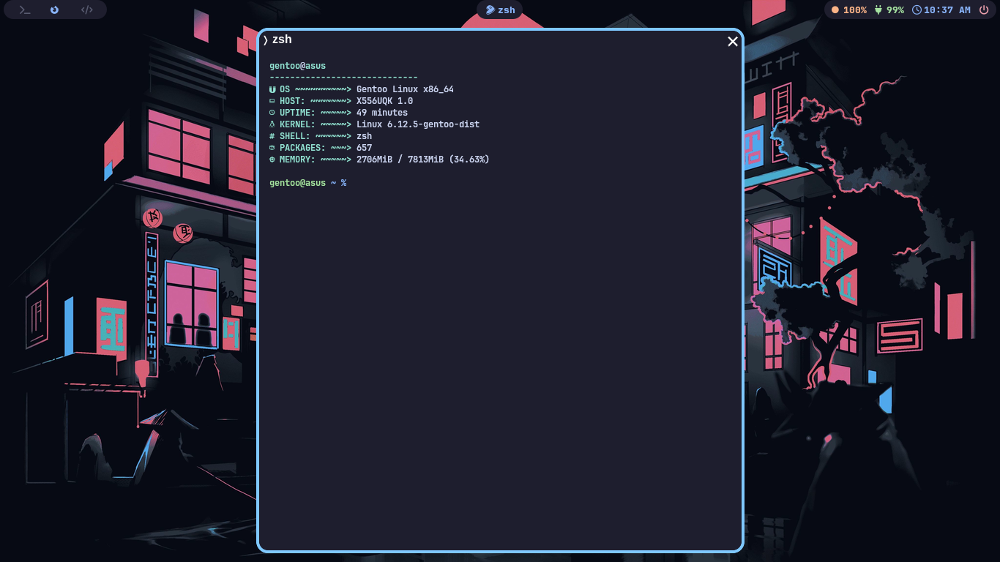

<h1 align="center">My Dotfiles for SwayFX or Niri</h1>

This is where I keep all of my dotfiles and scripts for my rice.

Feel free to copy any of the dotfiles or scripts you find here, as much of it is just copied from others' dotfiles. I wouldn't recommend cloning my entire setup, but instead to try copying bits and pieces as you put together your own dotfiles unique to you. As what I did to my own dotfiles. I started to learn how to do stuff in ricing!

I host a DNS Server at the same machine I do stuff which is unbound, so you might need to install unbound to use my dotfiles. This unbound configuration is advanced, complex, and uses dns over tls as a dns forwarder. 

For other projects made by me, go to my [Page](https://github.com/gentoo-based). There, you'll see my projects that I am working on, such as my dotfiles, and different types of reimplementation of fetcher, a reimagined neofetch that suddenly discontinued.
